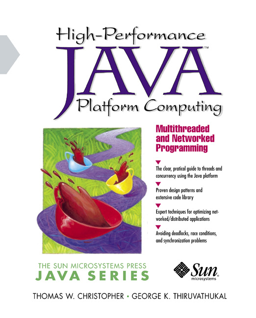

# High Performance C# Multithreaded Programming
This is a C# implemenmtation of the `Takk<T>` to generate dataflow graphs. It was inspired by Thomas Christopher's book
[*High Performance Java Computing: Multithreaded and Networked Programming*](http://www.oracle.com/technetwork/java/performance2-139813.html).

## From the book:
[](http://www.oracle.com/technetwork/java/performance2-139813.html)
>Christopher, Thomas W., and George Thiruvathukal. 
>*High Performance Java Computing: Multi-threaded and Networked Programming*. 
>Hemel Hempstead: Prentice Hall, 2000. Print.

## Features:
- Tasks
- Dataflows

## Links:
- [Community Edition of Visual Studio (Free)](https://www.visualstudio.com/vs/community/)
- [Git Extensions (Free)](http://gitextensions.github.io/)
- [ReSharper, Extensions for .NET Developers (trial)](https://www.jetbrains.com/resharper/)
- [High Performance Java Computing: Multithreaded and Networked Programming (out of print)](http://www.oracle.com/technetwork/java/performance2-139813.html)

## Sample code
Here's a [two-operand task](HighPerformance/Textbook/Chapter07/BinAddFloatArrayLazy.cs) that evaluates the sum of the array, when the Result is called. 
The value is only calculated once, and only on demand. If the Result is never called, the result memory is not allocated and sum operation never occurs.
[Look here, at line 30](HighPerformanceTests/Textbook/Chapter07Tests/BinAddFloatArrayLazyTests.cs), for an example of how it's used.
```C#
public class BinAddFloatArrayLazy
{
    private readonly Lazy<float[]> _left;
    private readonly Lazy<float[]> _right;

    public BinAddFloatArrayLazy(Lazy<float[]> left, Lazy<float[]> right)
    {
        _left = left;
        _right = right;
        Result = new Lazy<float[]>(Run);
    }

    public Lazy<float[]> Result { get; }

    public float[] Run()
    {
        var left = _left.Value;
        var right = _right.Value;
        var sum = new float[left.Length];
        for (var i = 0; i < left.Length; i++)
            sum[i] = left[i] + right[i];
        return sum;
    }
}
```

## Author
:fire: [Greg Eakin](https://www.linkedin.com/in/gregeakin)
